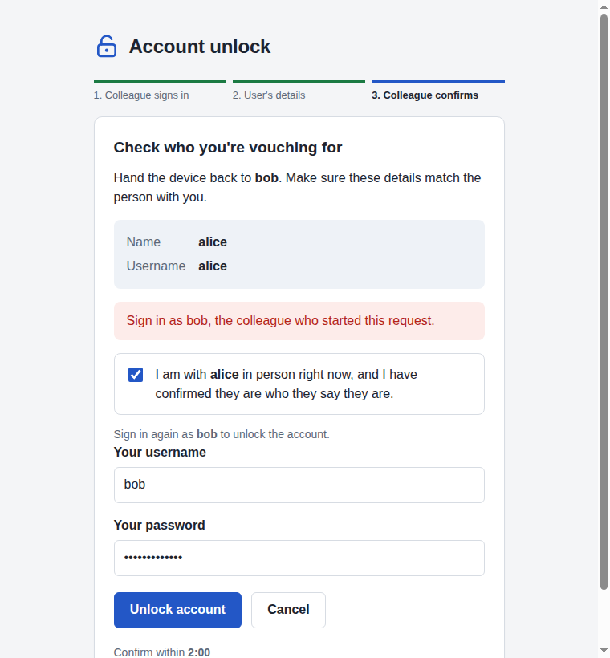

# vouch

Self-service unlock for locked Active Directory accounts. A colleague from an authorised group
vouches for the user in person, in the same browser.



## How it works

1. **A colleague signs in first.** They must be in one of the configured voucher groups (nested
   membership counts). This starts an unlock session in their browser.
2. **The colleague hands the device to the locked-out user, who enters their username and
   current password.** vouch binds to AD as them. If AD says the account is locked out and it's
   eligible for self-service unlock, the user's directory details are shown for the colleague to
   check. If the password simply works, the account isn't locked and nothing more is done. The
   colleague can't enter their own account here.
3. **The colleague checks the details, confirms they are with the user and have confirmed their
   identity, and enters their own username and password again.** It must be the same account
   that started the session. vouch then clears the account's lockout and immediately binds as
   the user with the password from step 2, against the same domain controller, to verify it.

### Why the password is checked after unlocking

While an account is locked, AD rejects every bind with `data 775`, whether or not the password
is right. There's no way to verify a locked user's password without unlocking the account first.
vouch therefore holds the password from step 2 in memory, server side only, until the colleague
confirms. It then unlocks the account and verifies the password straight away. This was confirmed
against the Samba AD DC in [`test/samba`](test/samba/README.md).

If the password turns out to be wrong, the account is already unlocked. The outcome is reported
as `verification_failed` and logged as a warning. The account's bad-password count starts again
from zero, so the person can make a few more guesses before AD locks it again. If that matters
more to you than the extra help-desk calls, set `policy.disableOnFailedVerification: true` and
vouch will disable the account instead.

### Keeping both people in the same place

The vouching has to happen in one browser on one machine:

* All three steps share one server-side session, started by the colleague's sign-in and
  identified by a random ID in an `HttpOnly`, `Secure`, `SameSite=Strict` cookie scoped to
  `/api/v1`. A user in another browser has no session to enter their details into.
* A session is tied to the client address and User-Agent that started it. A request from
  anywhere else cancels the session outright.
* The colleague signs in at the start and again at the end, so they have to be at the machine
  both before and after the user enters their details.
* Time limits: by default the whole exchange must finish within 5 minutes of the colleague
  signing in. The colleague must confirm within 2 minutes of the user entering their details,
  otherwise the user's details are discarded and must be entered again.
* The colleague has to tick an explicit attestation naming the user before the unlock button
  works.
* State-changing requests must be same-origin JSON (`Origin`/`Sec-Fetch-Site` checks).
  Failed attempts are rate limited per client address and per account, however it's named.
  Successful steps don't count, so a service desk machine can do many unlocks in a row.

This is presence *enforcement* in the "same browser" sense, not proof that two people were in
the room. Both people type a password on the same machine, so only use vouch on machines you'd
trust with both. The page asks password managers and browsers not to save either person's
credentials, but browsers don't always comply.

### Audit log

Every decision is logged on the `audit` logger with an `audit_id` per session, the client
address, the claimed user, the voucher, and the AD bind result. Session IDs and passwords are
never logged. Use `--log-format json` to ship the log to a SIEM.

## Active Directory setup

**Service account.** Create a dedicated account (e.g. `svc-vouch`). It needs:

* Read access to users and groups. Domain Users already have this by default.
* Write access to `lockoutTime` on the user objects that may be unlocked:

  ```bat
  dsacls "OU=Staff,DC=example,DC=com" /I:S /G "EXAMPLE\svc-vouch:WP;lockoutTime;user"
  ```

* Write access to `userAccountControl` as well, but only if `disableOnFailedVerification` is on:

  ```bat
  dsacls "OU=Staff,DC=example,DC=com" /I:S /G "EXAMPLE\svc-vouch:RPWP;userAccountControl;user"
  ```

Don't delegate at the domain root. Accounts protected by AdminSDHolder (`adminCount=1`) don't
inherit delegations, so the service account can't unlock domain admins even if they aren't in a
protected group. List them in `protectedGroups` anyway, so vouch refuses before it tries.

**Voucher groups.** Create or choose a group such as the service desk or team leads, and list
its DN in `policy.voucherGroups`. Membership is resolved with `LDAP_MATCHING_RULE_IN_CHAIN`, so
nested groups count. Primary group membership (normally Domain Users) isn't seen.

**Connection.** Use `ldaps://` or `ldap://` with `startTLS: true`. A plain `ldap://` simple
bind sends passwords in clear text, and AD's LDAP signing policy may refuse it anyway.

## Configuration

vouch reads `vouch.yml` from the working directory, or the file given by `--config-file`. The
shipped [`vouch.yml`](vouch.yml) documents every key. Unknown keys are rejected. The main
sections are:

| Section | Purpose |
|---|---|
| `web` | Listen address, optional TLS, trusted reverse proxies, and page text. |
| `directory` | Domain controller URLs, TLS trust, base DN, service account, user filter. |
| `policy` | Voucher, protected and eligible groups, time limits, rate limits, and what to do if verification fails. |

Run vouch behind HTTPS. Either set `web.tlsCertFile`/`web.tlsKeyFile`, or put it behind a
reverse proxy and list the proxy in `web.trustedProxies` so the real client address is used for
presence checks and rate limits.

Flags such as `--log-level` and `--log-format` are shown by `./vouch --help`. Each can also be
set as a `VOUCH_*` environment variable.

## Building

```sh
go run mage.go binary
./vouch --config-file vouch.yml
```

The build installs the Node.js version in `.nvmrc` into `.node/`, builds the web interface in
`web/` and embeds it in the binary. `go run mage.go -l` lists every target. CI runs `style`,
`lint`, `test` and `binary`.

Once the repository is on GitHub, `.github/workflows/container.yml` builds a container image and
publishes it to `ghcr.io/wrouesnel/vouch`. Mount your configuration over `/app/vouch.yml`.

## Development

| Path | Purpose |
|---|---|
| `api/vouch.yaml` | OpenAPI 3 definition of the API. `go generate ./pkg/api` regenerates the Echo v5 server in `pkg/api`. |
| `pkg/directory` | AD access over LDAP: lookups, binds, nested groups, unlock. `directorytest` holds an in-memory fake with AD's lockout behaviour. |
| `pkg/unlock` | The workflow: sessions, presence checks, eligibility, rate limits and audit logging. |
| `pkg/server` | Echo HTTP server: API handlers, cookies, security headers, and the embedded web interface. |
| `pkg/entrypoints/vouch` | Command line, configuration and startup. |
| `web/` | TypeScript and Vite web interface. `npm run dev` serves it with the API proxied to `:8080`. |
| `test/samba/` | A disposable Samba AD DC in rootless podman, for integration tests. |

Unit tests run without a directory. The integration tests need the Samba DC:

```sh
test/samba/start.sh
VOUCH_SAMBA_URL=ldap://127.0.0.1:10389 go test -count=1 -run Samba -v ./pkg/directory/
./vouch --config-file test/samba/vouch-samba.yml   # try the UI at http://127.0.0.1:8080
test/samba/stop.sh
```

The test domain has `alice` (to unlock), `bob` (a voucher, in `Helpdesk` through a nested group),
`carol` (can't vouch) and `dadmin` (protected). Each user's password is
`Passw0rd-<name>!`. Lock `alice` out with three bad binds, for example
`ldapwhoami -x -H ldap://127.0.0.1:10389 -D CN=alice,CN=Users,DC=vouch,DC=test -w wrong`.
